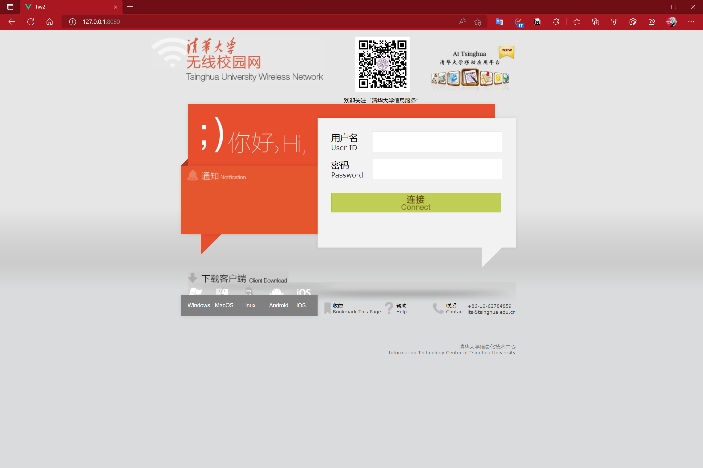
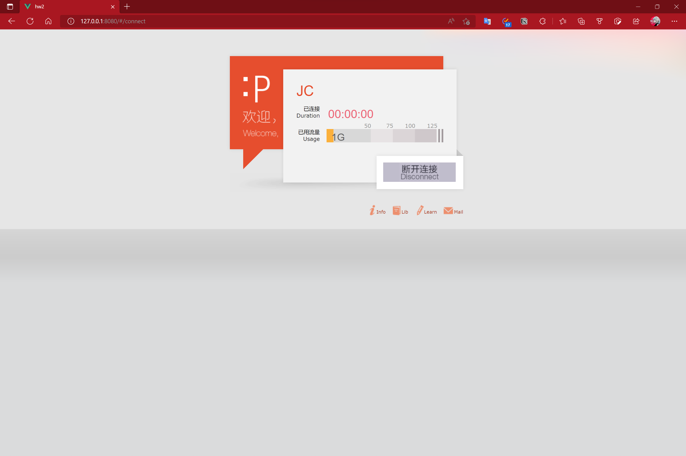
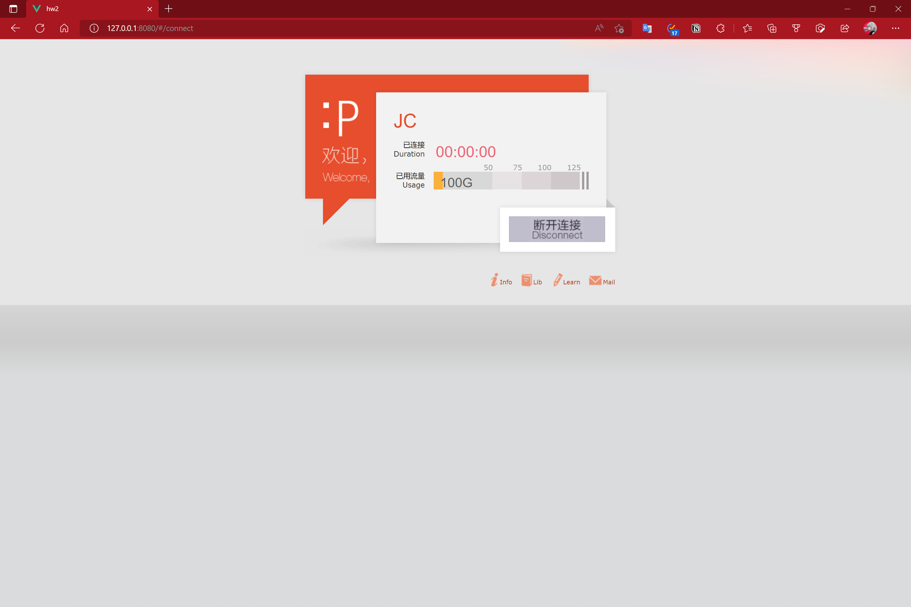

# hw2

`此目录下PDF为此markdown文件导出`

## dependencies
```
Flask-Cors==3.0.10
  - Flask [required: >=0.9, installed: 2.1.3]
    - click [required: >=8.0, installed: 8.1.3]
      - colorama [required: Any, installed: 0.4.5]
    - itsdangerous [required: >=2.0, installed: 2.1.2]
    - Jinja2 [required: >=3.0, installed: 3.1.2]
      - MarkupSafe [required: >=2.0, installed: 2.1.1]
    - Werkzeug [required: >=2.0, installed: 2.1.2]
  - Six [required: Any, installed: 1.16.0]
pipdeptree==2.2.1
  - pip [required: >=6.0.0, installed: 22.1.2]
setuptools==62.6.0
wheel==0.37.1

Vue3
```

## Use

- for backend `python ./backend/main.py`

- for frontend `npm run serve`

然后即可在 `127.0.0.8080` 访问

## 实现功能

可以通过`127.0.0.8080`访问到起始页面

可以通过点击连接按钮跳转到连接成功的界面此时默认值为1

再次点击断开连接跳转回起始页面,此时数据已经在后端修改为100,再次在起始页面点击连接后,

流量值已经被修改为100