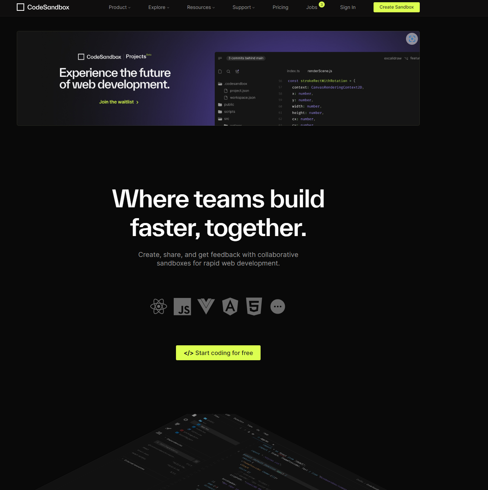
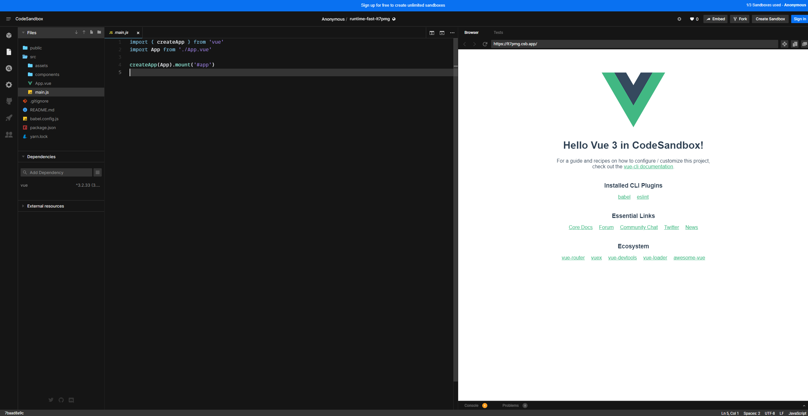
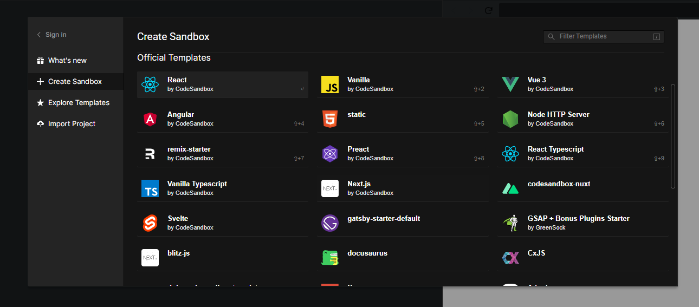
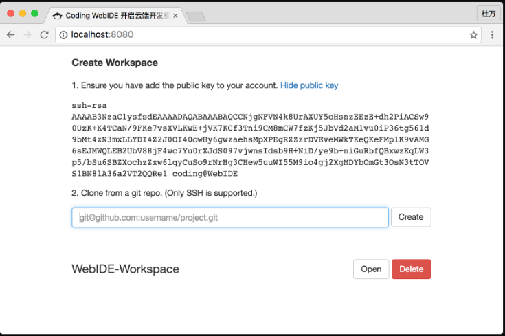
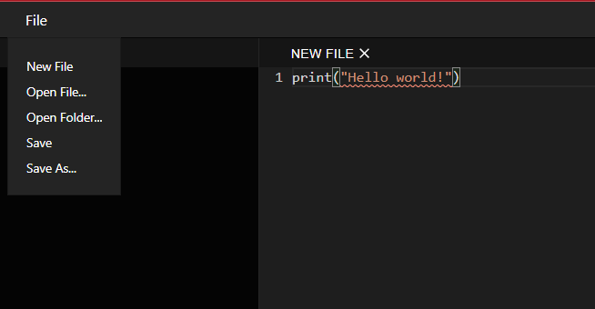
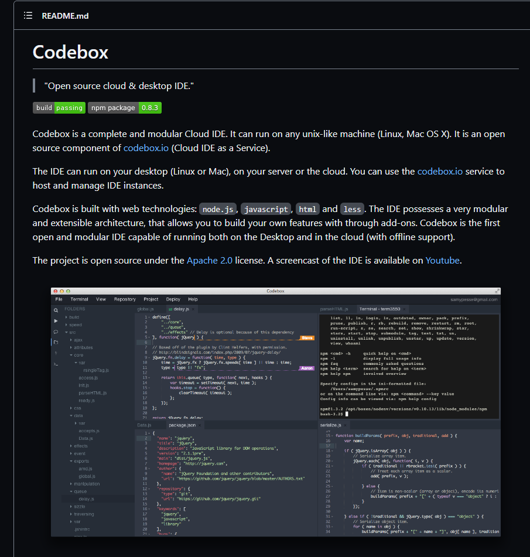
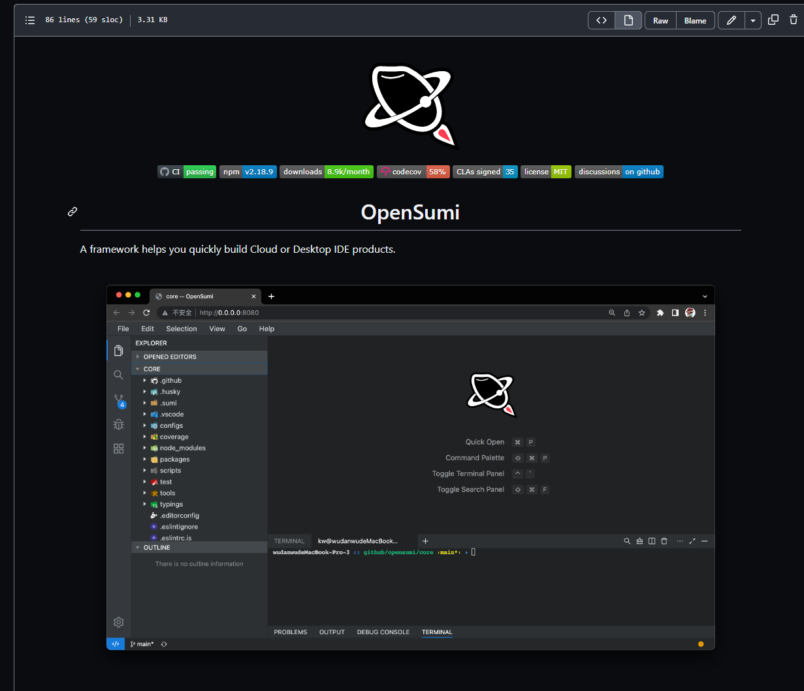

# 小学期大作业
---

## 参考项目

### [这是一个python的解释器,很轻量](https://github.com/pyscript/pyscript)

PyScript is a framework that allows users to create rich Python applications in the browser using HTML's interface and the power of Pyodide, WASM, and modern web technologies. The PyScript framework provides users at every experience level with access to an expressive, easy-to-learn programming language with countless applications.

### [Github第一的项目](https://github.com/Codiad/Codiad)

Codiad is a web-based IDE framework with a small footprint and minimal requirements.

不过感觉难度有点大

### [GIthub最高star](https://github.com/codesandbox/codesandbox-client)
太帅了

### [华人做的一个IDE](https://github.com/Coding/WebIDE)

#### Modules
WebIDE-Frontend: contains frontend code.
WebIDE-Frontend-Webjars: packs frontend to webjar.
WebIDE-Backend: contains backend code.

### [前端](https://github.com/Coding/WebIDE-Frontend)
This repo contains frontend code of the Coding WebIDE Community Edition. Please refer to the WebIDE repo for instruction on running the whole project.

### [后端](https://github.com/Coding/WebIDE-Backend)
本项目是开源版 WebIDE 的后端程序

### [一个比较简单的项目, 实现了文件上传下载](https://github.com/ada2468/Web_IDE)

### [CodeBox](https://github.com/CodeboxIDE/codebox)

### [最后一个 一个framework](https://github.com/opensumi/core/blob/main/README.md) 

---

## VScode?

- 明确
1. 任务,工作,分工
2. ddl
3. 下一次组会时间
